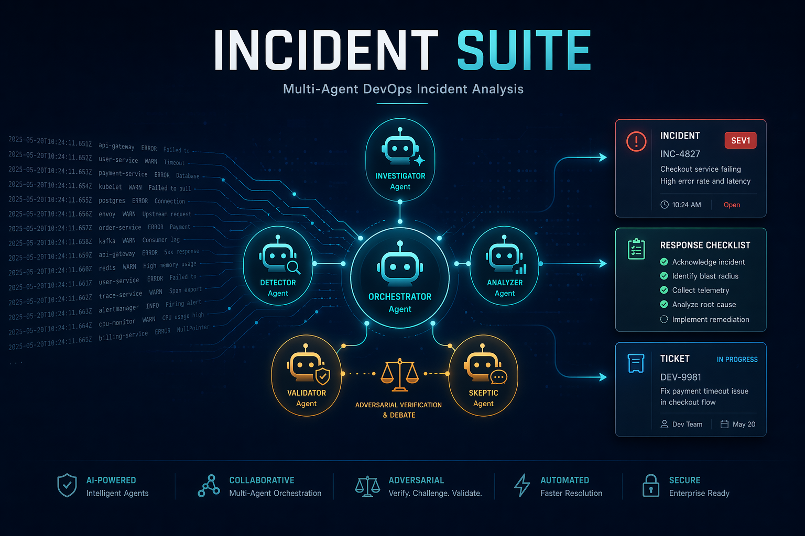
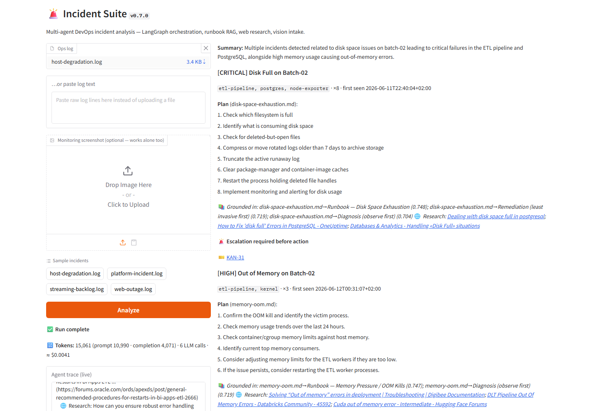
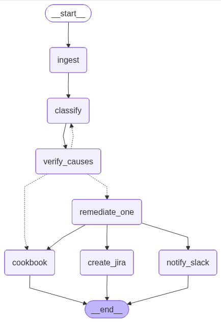
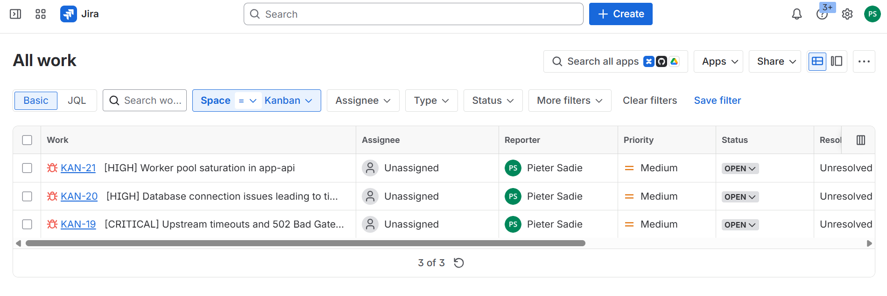
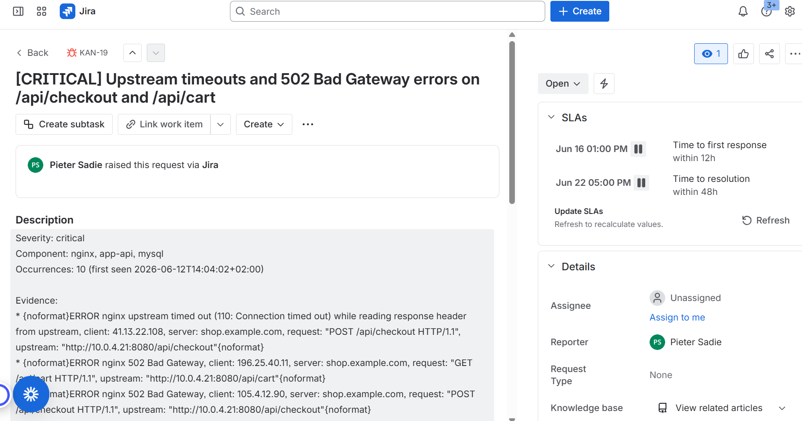

# Incident Suite — Multi-Agent DevOps Incident Analysis



> Upload ops logs (and optionally a monitoring screenshot) → specialized agents classify incidents, ground remediation plans in a runbook corpus via RAG, enrich them with live web research, notify Slack, raise JIRA tickets, and synthesize an actionable cookbook — orchestrated with LangGraph. Agents **reason with each other**: an adversarial Critic agent independently re-derives root causes, disputes the Classifier, and reviews every remediation plan through bounded revision loops — with full agent-trace transparency and an Inspect AI eval suite.

**Eng Accelerator Hackathon — Topic 1.** Built by Pieter Sadie.

🎬 **[Watch the demo video (Loom)](https://www.loom.com/share/2b24517d66d44cb894dd8057e26713cf)** — why the app exists, uploading logs & monitoring screenshots, live analysis, and posting to Slack + JIRA.

⚖ **[Critic agent deep-dive (Loom)](https://www.loom.com/share/e41f07c81f8544509e6a9542316a5690)** — agents reasoning with each other: the Critic independently re-derives root causes, disputes the Classifier, forces a revision round, and reviews every remediation plan.



## Architecture

```
        ┌────────────────────────────────────────────────────┐
        │               Gradio Operator Console               │
        │  upload log + optional screenshot · live trace · UI │
        └───────────────────────┬────────────────────────────┘
                                │
                 ┌──────────────▼──────────────┐
                 │ Ingest (side-channel parser) │←─ 👁 Vision intake
                 │ raw log NEVER enters the LLM │   (screenshot → observations)
                 └──────────────┬──────────────┘
                                │
                 ┌──────────────▼──────────────┐
                 │  🔎 Classifier (structured    │
                 │     JSON output, Pydantic)   │◄───┐ disagreement →
                 └──────────────┬──────────────┘    │ one revision round
                 ┌──────────────▼──────────────┐    │
                 │ ⚖ Critic — independently     │────┘
                 │  re-derives root causes,     │
                 │  agrees / objects (verdicts) │
                 └──────────────┬──────────────┘
                                │  LangGraph Send API — one parallel
                                │  branch PER incident (map-reduce)
              ┌─────────────────┼─────────────────┐
        ┌─────▼─────┐     ┌─────▼─────┐     ┌─────▼─────┐
        │ 🛠 Remediate│     │ 🛠 Remediate│ ... │ 🛠 Remediate│
        │ 📚 RAG over │     │ 📚 + 🌐 web │     │  (per      │
        │  runbooks/  │     │   research  │     │  incident) │
        │ ⚖ plan      │     │ ⚖ plan      │     │ ⚖ plan     │
        │  reviewed   │     │  reviewed   │     │  reviewed  │
        └─────┬─────┘     └─────┬─────┘     └─────┬─────┘
              └─────────────────┼─────────────────┘
              ┌─────────────────┼─────────────────┐
         ┌────▼────┐      ┌─────▼────┐      ┌─────▼─────┐
         │ 💬 Slack │      │ 🎫 JIRA  │      │ 📕 Cookbook │
         │ notifier │      │ tickets  │      │ checklist  │
         └─────────┘      └──────────┘      └───────────┘
```

The compiled LangGraph, rendered live in the app — note the dashed critic
loop between `verify_causes` and `classify`:



## Tech stack

| Layer | Tech |
|---|---|
| Orchestration | **LangGraph** — `StateGraph`, conditional edges, **Send API map-reduce** (parallel branch per incident), implicit joins |
| Agents & contracts | **LangChain** structured outputs over **Pydantic** schemas at every boundary |
| RAG | **Chroma** vector store + **FastEmbed** local embeddings (`BAAI/bge-small-en-v1.5`, ONNX — no API key) + `MarkdownHeaderTextSplitter` heading-aware chunking with scored citations |
| Models | **OpenRouter** (one key, any model) — text + vision |
| Web research | **Tavily** search per incident (optional, graceful skip) |
| UI | **Gradio** — streaming agent trace, graph diagram rendered from the compiled LangGraph |
| Evals | **Inspect AI** — LLM judge vs deterministic known-incidents checklist |

## Design principles

1. **Side-channel doctrine** — raw log files never ride the LLM context. The ingest
   layer parses, deduplicates and windows the log in Python; agents receive compact
   structured extracts only.
2. **Guarded actions** — the Remediation agent *proposes* steps with rationale and
   per-step risk; it never executes anything. Slack/JIRA are the only outbound
   writes, both explicit and severity-gated.
3. **Structured outputs everywhere** — every agent boundary is a strict Pydantic
   schema; no free-text handoffs.
4. **Grounding over generation** — remediation plans cite their runbook chunks
   (with similarity scores) and web sources; ungrounded plans escalate to a human.
5. **Adversarial verification** — agents reason WITH each other, not just hand
   off: the Critic agent re-derives root causes independently from the same
   evidence (never seeing the Classifier's reasoning) and judges each incident;
   disagreement loops the classification back for one bounded revision. Every
   remediation plan gets the same treatment — objections trigger one revision,
   and a still-contested plan is forced to escalate. All verdicts stream in the
   trace and render in the UI.
6. **Transparency** — the UI streams the LangGraph node trace live: ingest stats,
   incidents found, RAG hits with scores, research results, delivery outcomes.
7. **Evaluated, not vibed** — `evals/` scores the Classifier against incidents
   deliberately seeded in the sample logs.

## Quick start

```bash
python -m venv .venv && .venv\Scripts\activate   # Windows (use Python 3.12)
pip install -r requirements.txt
cp .env.example .env                              # add your OpenRouter key
python app.py                                     # opens the Gradio console
```

Only `OPENROUTER_API_KEY` is required. Slack, JIRA and Tavily are optional —
agents report "skipped" gracefully. First run downloads the local embedding
model (~130 MB) once.

Try it immediately: pick a sample from `data/sample_logs/` in the UI.

### Live RAG demo — grow the knowledge base mid-session

`data/sample_runbooks/` holds documents that are deliberately **not** in the
indexed corpus (`runbooks/` is auto-indexed at startup; these aren't):

- `postmortem-2026-03-checkout-outage.md` — a post-mortem whose hard-won
  lesson ("roll back first, scaling out makes a connection leak WORSE")
  changes the remediation advice for pool-exhaustion incidents.
- `batch-job-sla-breach.md` — a runbook for ETL/batch SLA breaches.

To demo: run a matching sample log and note the plan (or its "no runbook
above threshold — first principles" trace line) → open the **📚 Knowledge
base** accordion → upload one of these files (you'll see it chunked live)
→ click **Analyze** again. The new plan now cites the just-added document,
with similarity scores — retrieval grounding changing agent behaviour in
real time.

## Evals

The classifier is scored with Inspect AI against incidents deliberately seeded
in the sample logs (LLM judge, deterministic known-incidents checklist —
identified? severity right? evidence grounded?). **Current result:
`accuracy 1.000` (2/2 samples CORRECT, gpt-4o-mini classifier, Sonnet judge).**

```bash
cd evals
inspect eval task_classifier.py --model openai/openai/gpt-4o-mini
inspect view
```

See `evals/README.md` for the OpenRouter env setup.

## Live integrations — proof

Tickets raised by the JIRA agent (severity-gated: critical/high only), with the
incident evidence and guarded remediation plan inside each ticket:





## Code tour — where each concept lives

| Concept | File | What to look at |
|---|---|---|
| **LangGraph orchestration** | `src/incident_suite/graph.py` | `build_graph()` — StateGraph, nodes, edges; `SuiteState` with reducer-merged `trace`/`plans` |
| **LangGraph Send API (map-reduce)** | `src/incident_suite/graph.py` | `route_after_verify()` returns one `Send("remediate_one", …)` per incident — parallel branches, implicit join |
| **Agent-vs-agent reasoning (critic loop)** | `src/incident_suite/agents/critic.py` + `graph.py` | `review_causes()` / `review_plan()`; `verify_causes` node + conditional loop edge back to `classify` (bounded by `MAX_CLASSIFY_ROUNDS`) |
| **Live agent trace** | `src/incident_suite/graph.py` + `app.py` | `_status()` → `get_stream_writer()` custom stream, merged with `values` stream in `run_suite()` |
| **LangChain structured outputs** | `src/incident_suite/agents/classifier.py`, `agents/remediation.py` | `llm.with_structured_output(<PydanticModel>)` — no free-text agent handoffs |
| **Schema contracts** | `src/incident_suite/schemas.py` | Every inter-agent payload; note `RemediationDraft` vs `RemediationPlan` (LLM never generates its own citations) |
| **RAG (Chroma + FastEmbed + HF model)** | `src/incident_suite/rag.py` | Heading-aware chunking, local `BAAI/bge-small-en-v1.5` embeddings, top-source confidence gate |
| **Side-channel ingest** | `src/incident_suite/ingest.py` | Log parsing/dedup in Python; `[context: operational event]` lines for deploy correlation |
| **Vision intake** | `src/incident_suite/vision.py` | Screenshot → observations via OpenRouter vision model |
| **Web research** | `src/incident_suite/agents/research.py` | Tavily per-incident, graceful no-key skip |
| **Guarded integrations** | `src/incident_suite/integrations/` | Slack webhook; JIRA with dynamic issue-type resolution, severity-gated |
| **Evals** | `evals/task_classifier.py` | Inspect AI task, LLM judge + deterministic known-incidents rubric |

## Repo layout

| Path | What |
|---|---|
| `app.py` | Gradio operator console |
| `src/incident_suite/ingest.py` | Side-channel log parser |
| `src/incident_suite/vision.py` | Screenshot → observations (vision intake) |
| `src/incident_suite/rag.py` | Chroma + FastEmbed runbook RAG |
| `src/incident_suite/graph.py` | LangGraph orchestrator (Send API map-reduce) |
| `src/incident_suite/agents/` | Classifier · Critic · Remediation · Research · Cookbook |
| `src/incident_suite/integrations/` | Slack webhook + JIRA REST clients |
| `runbooks/` | Remediation knowledge corpus (12 runbooks, RAG source) |
| `data/sample_logs/` | Reproducible demo incidents |
| `data/sample_screenshots/` | Synthetic monitoring dashboard for the vision-intake demo (upload alongside a log) |
| `data/sample_runbooks/` | NOT pre-indexed — upload via the Knowledge-base panel to demo live RAG re-indexing |
| `evals/` | Inspect AI eval of the Classifier agent |
